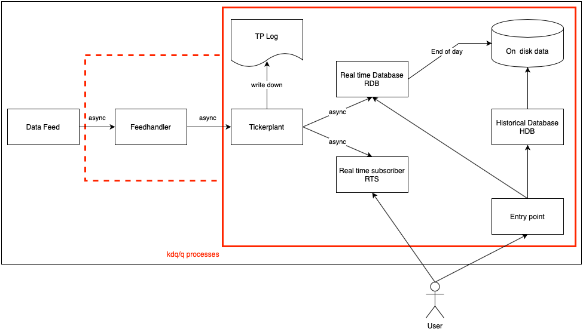

# Plain vanilla KDB-tick architecture

The core components of every KDB-tick architecture consist of the following 3 components: 
- a Ticker Plant (TP)
- a real-time Database (RDB)
- a historical Database (RDB)

In a plain vanilla KDB-tick setup you would generally also find a Feedhandler (FH) who receives data from a Data Feed. The below image illustrates the plain vanilla KDB-tick architecture. The follwoing section describes each component in more detail.

## Data Feed 

The data feed (upstream) provides our application with real time data. This can be an exchange, a (financial) data provider such as Bloomberg or Thomson Reuters or an internal data procider (banks or other financial institutions often have their own internal data providers). Time granularity can range from seconds, to milli seconds to even nano seconds. We can caputre pretty much any data we are interested in including financial data such as equties, currencies, commodities, crypto currencies data but also non financial data such as data coming from sensors or IOT devices (Internet of Things). 

## Feedhandler (FH)

The feedhandler is the intersection between the data feed and the tickerplant. It captures the data from the data feed and sends it to the tickerplany. The feedhandler is generally written in a low latency programming language such as Java or C++ but can also be written in KDB/Q. In order to avoid any latency the feedhandler sends all data asynchronously to the tickerplant.

## Ticker Plant (TP)

The tickerplant is the most important component in the tick architecture and should UNDER NO CIRCUMSTANCES crash or die. For that specific reason a tickerplant should always be designed as lightweight as possible and only be in charge of two tasks:
- log all incoming tick data to a TP LOG file
- forward all incoming tick data to its real time subscribers

The tickerplant can operate in two different modes: 1. the batch mode, the tickerplant will batch incoming data and send it every X-seconds to all its real timer subscribers. 2. the real-time or tick mode, the tickerplant will send all incoming messages straight through to all its real timer subscribers. 

In order to avoid any latency or an output queue memory build up on the tickerplant side, the tickerplant sends all messages asynchronously to the real time subscribers. When starting up the tickerplant will load the schmea of the defined tables for the data we want to capture and verify that each table has a time and symbol column. Given that we store data in cronological order it's necessary that each table has a time column defined. Moreover, the sym column specifies the identifier of the data we capture. The tickerplant also applies the group attribute to the sym column of every table. Given that we only store data for a short period of time in the tickerplant this is not necessarily necessary, however, given that the real time subscribers such as the RDB receive the table schemas (with all their attributes) from the tickerplant when subscribing to it we need the group attribute.

## Real-time subscribers

The KDB-tick architecture can have several different real time subscribers. The most common among them is the real-time database (RDB) which stores all intraday data in memory. Other examples could be a CEP (Complex Event Processing Engine), CTPs (Chained tickerplants) or any other real time subscriber that is intrested in the data.

### Real-time Database (RDB)

The real-time database (RDB) is the most common among all real-time subscribers and stores intraday data. A typical example would be equities or foreign exchange data between the business hours of the specific asset class. In simple terms, the RDB is a KDB/Q process that contains all intraday data in memory which makes data access much faster than querying data from disk. 

### Others

## Historical Database

## Entry point

